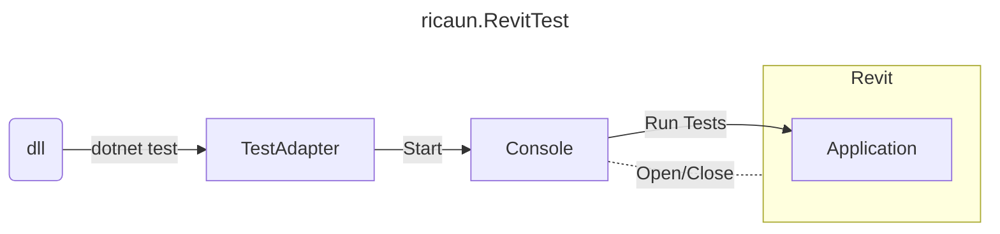

# RevitTest.Samples

[](../..)
[](../..)
[](https://nuke.build/)
[](LICENSE)
[](../../actions)
[](https://www.nuget.org/packages/ricaun.RevitTest.TestAdapter)

[](https://github.com/ricaun-io/RevitTest)

[ricaun.RevitTest](https://github.com/ricaun-io/ricaun.RevitTest) is a Framework to execute NUnit tests using Visual Studio and Revit.

**This project contain samples and the basic info about the [ricaun.RevitTest](https://github.com/ricaun-io/ricaun.RevitTest) Framework.**

## Sample

The sample project contains the basic usage of the [ricaun.RevitTest](https://github.com/ricaun-io/ricaun.RevitTest) Framework.

* [RevitTest.Sample](RevitTest.Sample)

## Install

To install the [ricaun.RevitTest.TestAdapter](https://www.nuget.org/packages/ricaun.RevitTest.TestAdapter), you can use the NuGet package manager.

### PackageReference 

The main package is [ricaun.RevitTest.TestAdapter](https://www.nuget.org/packages/ricaun.RevitTest.TestAdapter) that manage the NUnit test execution of tests inside Revit.

***The machine need to have the Revit installed to work.***

```xml
<PackageReference Include="NUnit" Version="3.13.3" />
<PackageReference Include="ricaun.RevitTest.TestAdapter" Version="*" />
```

### IsTestProject

If your are using `dotnet test` to execute the tests, you need to add the `IsTestProject` property to the `.csproj` file.

```xml
<IsTestProject>true</IsTestProject>
```

## Wiki

For more information see [Wiki](https://github.com/ricaun-io/RevitTest/wiki).

## ricaun.RevitTest

The [ricaun.RevitTest](https://github.com/ricaun-io/ricaun.RevitTest) Framework is composed by 3 projects:



* **TestAdapter**: The NUnit TestAdapter is responsible for executing the `Console` and waits for the tests results.
* **Console**: The Console application responsible for communicating with Revit, installing the `Application`, and opening/closing Revit.
* **Application**: The Revit Plugin application is responsible for executing the tests sent by `Console`.


## FAQ

</details>

<details><summary>The <b>ricaun.RevitTest</b> Framework is free to use ?</summary><br>

Yes.

</details>

<details><summary>The <b>ricaun.RevitTest</b> Framework is open-source ?</summary><br>

No, maybe yes in the future.

</details>

<details><summary>Do you need an account to use the <b>ricaun.RevitTest</b> Framework ?</summary><br>

Yes, to use the `Application` inside Revit you need to have an Autodesk account to authenticate with [ricaun.io](https://ricaun.io/) using [Autodesk Platform Services](https://aps.autodesk.com/).

</details>

<details><summary>The <b>ricaun.RevitTest</b> Framework works offline ?</summary><br>

Not yet, but is in the roadmap (15 days offline after authentication).

</details>

<details><summary>The <b>ricaun.RevitTest</b> Framework works with Design Automation for Revit ?</summary><br>

Yes, is possible to switch the `Console` to run the tests using the Design Automation for Revit instead of the Revit for desktop. (Not available yet)

</details>

<details><summary>The <b>ricaun.RevitTest</b> Framework works in Rider ?</summary><br>

I tested with Rider, and works with some issues: [RevitTest in Rider - 1.1.2-beta](https://youtu.be/_xgkd6ItSrg)

</details>

<details><summary>Do you have plans to create a similar test framework for AutoCAD or Inventor ?</summary><br>

Could be possible, but I only use Revit so I don't have the incentive to do that.

</details>

<details><summary>How the <b>ricaun.RevitTest</b> Framework knows what Revit version to open ?</summary><br>

The `TestAdapter` checks for some `RevitApi` reference in the test assembly and get the version from it. If not found, the `TestAdapter` will use the lowest version of Revit installed in the machine.

</details>

<details><summary>How the force to use a specific Revit version ?</summary><br>

To overwrite the version selection of the `TestAdapter`, you can use the `AssemblyMetadataAttribute` property with `NUnit.Version` in the test project, like this:

In the `.cs` file:
```csharp
[assembly: System.Reflection.AssemblyMetadata("NUnit.Version", "2024")]
```
Or in the `.csproj` file:
```xml
<ItemGroup>
  <AssemblyAttribute Include="System.Reflection.AssemblyMetadataAttribute">
    <_Parameter1>NUnit.Version</_Parameter1>
    <_Parameter2>2024</_Parameter2>
  </AssemblyAttribute>
</ItemGroup>
```

</details>

<details><summary>How the force to use a specific Revit language ?</summary><br>

To force the `TestAdapter` to open Revit with a specific language, you can use the `AssemblyMetadataAttribute` property with `NUnit.Language` in the test project, like this:

In the `.cs` file:
```csharp
[assembly: System.Reflection.AssemblyMetadata("NUnit.Language", "ENU")]
```
Or in the `.csproj` file:
```xml
<ItemGroup>
  <AssemblyAttribute Include="System.Reflection.AssemblyMetadataAttribute">
    <_Parameter1>NUnit.Language</_Parameter1>
    <_Parameter2>ENU</_Parameter2>
  </AssemblyAttribute>
</ItemGroup>
```

</details>

<details><summary>How the force to open a new Revit process ?</summary><br>

By default `TestAdapter` uses the Revit process opened with the same version to run the tests.
To overwrite and force to open a new process, you can use the `AssemblyMetadataAttribute` property with `NUnit.Open` in the test project, like this:

In the `.cs` file:
```csharp
[assembly: System.Reflection.AssemblyMetadata("NUnit.Open", "true")]
```
Or in the `.csproj` file:
```xml
<ItemGroup>
  <AssemblyAttribute Include="System.Reflection.AssemblyMetadataAttribute">
    <_Parameter1>NUnit.Open</_Parameter1>
    <_Parameter2>true</_Parameter2>
  </AssemblyAttribute>
</ItemGroup>
```

</details>

<details><summary>How the force to close Revit after the test finish ?</summary><br>

By default `TestAdapter` does not closes Revit after finish a test.
To overwrite and force to close Revit, you can use the `AssemblyMetadataAttribute` property with `NUnit.Close` in the test project, like this:

In the `.cs` file:
```csharp
[assembly: System.Reflection.AssemblyMetadata("NUnit.Close", "true")]
```
Or in the `.csproj` file:
```xml
<ItemGroup>
  <AssemblyAttribute Include="System.Reflection.AssemblyMetadataAttribute">
    <_Parameter1>NUnit.Close</_Parameter1>
    <_Parameter2>true</_Parameter2>
  </AssemblyAttribute>
</ItemGroup>
```

</details>

<details><summary>How to enable log in the TestAdapter ?</summary><br>

The log verbosity has two levels `1`(Normal) and `2`(Debug), to enable you can use the `AssemblyMetadataAttribute` property with `NUnit.Verbosity` in the test project, like this:

In the `.cs` file:
```csharp
[assembly: System.Reflection.AssemblyMetadata("NUnit.Verbosity", "1")]
```
Or in the `.csproj` file:
```xml
<ItemGroup>
  <AssemblyAttribute Include="System.Reflection.AssemblyMetadataAttribute">
    <_Parameter1>NUnit.Verbosity</_Parameter1>
    <_Parameter2>1</_Parameter2>
  </AssemblyAttribute>
</ItemGroup>
```

</details>


## License

This project is [licensed](LICENSE) under the [MIT Licence](https://en.wikipedia.org/wiki/MIT_License).

---

Do you like this project? Please [star this project on GitHub](../../stargazers)!